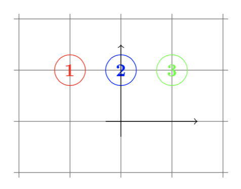

# Multiclass classification of movies using their subtitles based on their ratings.

# Task
A motion picture content rating system is an organization designated to classify films based on their suitability for audiences due to their treatment of issues such as sex, violence, or substance abuse; their use of profanity; or other matters typically deemed unsuitable for children or adolescents. 

The Motion Picture Association of America (MPAA) classifies movies into 5 categories.

The task is to classify movies into these five categories while exploring the various multiclass classification algorithms. I worked on this project while I was working as an RA in the McCombs School of Business.

# Evaluation
The evaluation metric used is accuracy per class and F1 score.

# Methodology
- Data preprocessing: The Data collected from various repositories was cleaned by dropping reapeated instances and structured data frames were created. The text data was then cleaned by removing stopwords, stemming and lemmatizing. tfidf vectorizer was used to obtain the required covaraites(1 grams, 2 grams and 3 grams) from the text. The titles were also tokenized and were used as features.

- Models : 

One vs all, all pairs and multiclass predictors were considered. Theoretically multiclass predictors should perform better than the other 2 kinds of classifiers. But this did not seem to be the case practically.

The classifiers used were:
#### One vs all : 
* SVC : accuracy = 0.45 , f1 score (weighted) = 0.47
* Logistic regression using liblinear solver with l2 penalty and balanced class weight : accuracy =.60 and f1 score = 0.605
#### Multiclass classification :
* SVC : accuracy = 0.57 and f1 score = 0.56
* Logisticregression with cv using lbfgs solver and balanced class weight : accuracy = 0.589 and f1 score = 0.578
#### All pairs :
* SVC : performed the worst with an ill-defined f1 score.

# Musings

### When will multiclass outperform all pairs and one vs all?

Reduction methods such as the One-versus-All and All-Pairs are simple and easy to construct from existing algorithms, but their simplicity has a price. The binary learner is not aware of the fact that we are going to use its output hypotheses for constructing a multiclass predictor, and this might lead to suboptimal results.

For example:

The probability masses for the above problem are 1:40%, 2-20%, 3-40%.
Observe that for the above problem of discriminating between class 2 and the rest of the classes, the optimal classifier would be the all negative classifier. Therefore, the multiclass predictor constructed by One-versus-All might err on all the examples from class 2. In contrast, if we choose a multiclass classifier with hi(x) = ⟨wi,x⟩, where w1 = (-1/√2,1/√2), w2 = (0,1),and w3 = (1/√2,1/√2), then the classifier defined by h(x) = argmaxi hi(x) perfectly predicts all the examples.

